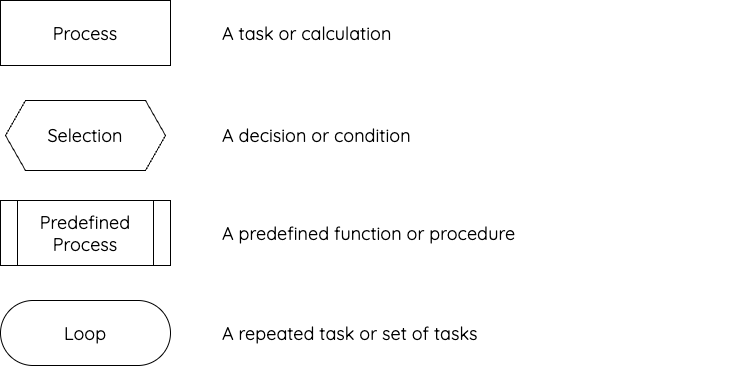
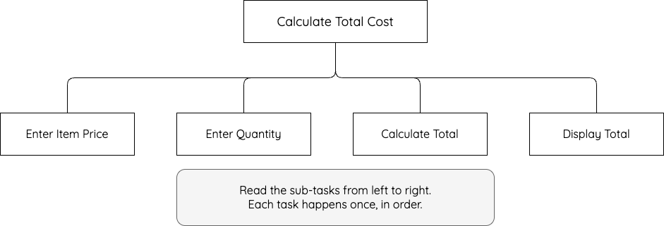
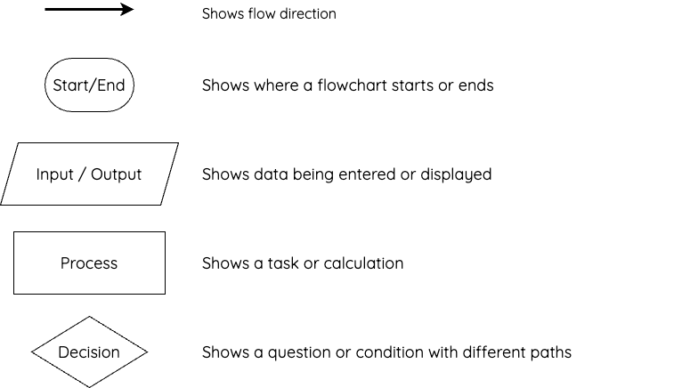
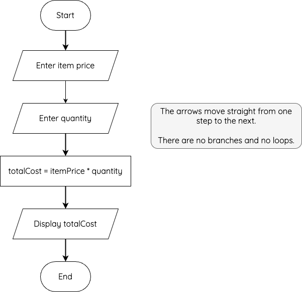

# Sequencing

!!! info "What you Need to Know"

    __You must be able__ to describe, identify, understand and read:

    * sequencing
    * sequencing in structure diagrams
    * sequencing in flowcharts
    * sequencing in pseudocode

Sequencing is one of the three programming constructs that can be shown using design notation:

* sequencing
* selection
* iteration

Sequencing means that instructions are carried out in a set order, one after another.

Most programs use sequencing. For example, a program that calculates the total cost of an order might:

1. ask the user for the item price
2. ask the user for the quantity
3. calculate the total cost
4. display the total cost

The order matters. The program cannot calculate the total cost until it has the item price and quantity.

## Structure Diagrams

In a structure diagram, sequencing is shown by placing sub-tasks from __left to right__ in the order they should happen.

The top box shows the main task. The boxes underneath show the sub-tasks needed to complete it.

Structure diagrams use different symbols to show processes, selections, predefined processes and loops.

!!! note "Structure diagram symbols"

    <figure markdown="span">
      { width="700" }
    </figure>

For the total-cost problem, the main task could be __Calculate Total Cost__. This can be broken down into four sub-tasks:

1. Enter item price
2. Enter quantity
3. Calculate total cost
4. Display total cost

These sub-tasks would be read from left to right. This shows the sequence of tasks.

!!! example "Sequencing shown as a structure diagram"

    <figure markdown="span">
      { width="700" }
    </figure>

## Flowcharts

In a flowchart, sequencing is shown by arrows moving from one step to the next.

Flowcharts are usually read from __top to bottom__. If the flowchart is only showing sequencing, the arrows move from one step to the next without branching or looping.

Flowcharts use different symbols to show the start and end of a program, inputs and outputs, decisions and processes.

!!! note "Flowchart symbols"

    <figure markdown="span">
      { width="700" }
    </figure>

For example:

!!! example "Sequencing shown as a flowchart"

    <figure markdown="span">
      { width="500" }
    </figure>

Each step happens once and in order. There is no decision and no loop.

## Pseudocode

In pseudocode, sequencing is shown by writing instructions in the order they should happen.

Pseudocode is usually read from __top to bottom__.

For example:

!!! example "Sequencing shown as pseudocode"

    ```pseudocode
    Main Steps

    1 Enter item price
    2 Enter quantity
    3 Calculate total cost
    4 Display total cost

    Refinements
    3.1 totalCost = itemPrice * quantity
    4.1 display totalCost
    ```

Each step is completed once, in order. There is no decision and no repetition.

__Spotting Sequencing__

To identify sequencing in design notation, look for instructions or tasks that:

* happen one after another
* are read in a clear order
* happen once
* do not branch in different directions
* do not loop back to an earlier step

If the design includes a question, condition or different possible paths, it is showing selection. If it repeats a task, it is showing iteration.

!!! info "Summary"

    * Sequencing means carrying out instructions in order.
    * In a structure diagram, sequencing is shown from left to right.
    * In a flowchart, sequencing is shown by arrows moving from one step to the next.
    * In pseudocode, sequencing is shown by writing instructions in order.
    * A sequence does not include a decision or a loop.
