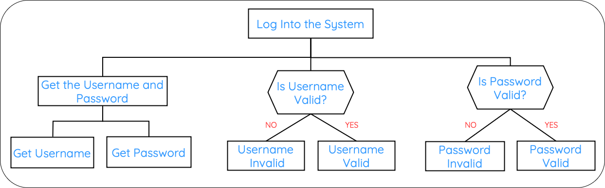

# Selection

!!! info "What you Need to Know"

    __You must be able__ to describe, identify, understand and read:

    * selection
    * selection in structure diagrams
    * selection in flowcharts
    * selection in pseudocode

Selection is one of the three programming constructs that can be shown using design notation.

Selection means that a program makes a decision. The next instruction depends on whether a condition is met.

For example, a program might check whether a password is correct:

* if the password is correct, display access granted
* if the password is incorrect, display access denied

## Structure Diagrams

In a structure diagram, selection is shown using a selection symbol. This symbol shows that the program may branch depending on a condition.

<figure markdown="span">
  { width="800" }
</figure>

In the example above, the program checks whether the username and password are valid. The result depends on the answer to each question.

To spot selection in a structure diagram, look for:

* a question or condition
* different possible outcomes
* branches such as yes/no

## Flowcharts

In a flowchart, selection is shown using a decision symbol. This is usually a diamond shape.

The decision has two or more possible paths. For example:

```text
Is password correct?
      |
   Yes/No
```

If the condition is true, the program follows one path. If the condition is false, the program follows a different path.

To spot selection in a flowchart, look for:

* a decision symbol
* a condition or question
* arrows branching in different directions

## Pseudocode

In pseudocode, selection is usually shown using `IF`, `ELSE` and `END IF`.

For example:

```pseudocode
Main Steps

1 Enter password
2 Check if password is correct
3 Display access message

Refinements

1.1 password = input
2.1 if password = "letmein"
2.2     message = "Access granted"
2.3 else
2.4     message = "Access denied"
2.5 end if
3.1 display message
```

The program checks a condition and chooses which instruction to carry out next.

!!! info "Summary"

    * Selection means making a decision.
    * In a structure diagram, selection is shown using a selection symbol and branches.
    * In a flowchart, selection is shown using a decision symbol.
    * In pseudocode, selection is usually shown using IF, ELSE and END IF.
