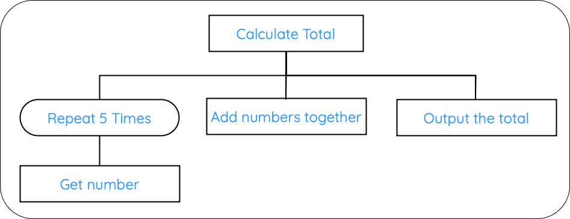

# Iteration

!!! info "What you Need to Know"

    __You must be able__ to describe, identify, understand and read:

    * iteration
    * iteration in structure diagrams
    * iteration in flowcharts
    * iteration in pseudocode

Iteration is one of the three programming constructs that can be shown using design notation.

Iteration means repeating a set of instructions. It is also known as looping.

For example, a program might repeat an instruction five times to ask the user for five numbers.

## Structure Diagrams

In a structure diagram, iteration is shown using a loop symbol. This shows that one or more sub-tasks will be repeated.

<figure markdown="span">
  { width="600" }
</figure>

In the example above, __Repeat 5 Times__ shows that the program will repeat the task __Get number__ five times.

To spot iteration in a structure diagram, look for:

* a loop symbol
* wording such as repeat
* a task that happens more than once

## Flowcharts

In a flowchart, iteration is shown by an arrow that loops back to an earlier step.

The loop usually continues while a condition is true, or until a condition is met.

For example:

```text
Enter password
      |
Is password correct?
  |           |
 No          Yes
  |           |
Try again   Continue
  |
  +---- back to Enter password
```

To spot iteration in a flowchart, look for:

* an arrow going back to an earlier step
* a decision that controls whether the loop continues
* a task that may happen more than once

## Pseudocode

In pseudocode, iteration is shown using loop commands such as `REPEAT`, `WHILE` or `FOR`.

For example:

```pseudocode
SET total TO 0

FOR counter FROM 1 TO 5
    SEND "Enter number" TO DISPLAY
    RECEIVE number FROM KEYBOARD
    SET total TO total + number
END FOR

SEND total TO DISPLAY
```

This loop repeats five times. Each time, the user enters a number and the number is added to the total.

!!! info "Summary"

    * Iteration means repeating instructions.
    * In a structure diagram, iteration is shown using a loop symbol.
    * In a flowchart, iteration is shown by an arrow looping back to an earlier step.
    * In pseudocode, iteration is shown using loop commands such as REPEAT, WHILE or FOR.
