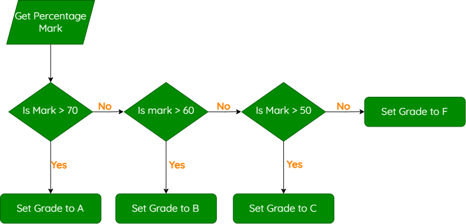

# Simple Conditional Statements

!!! info "What You Need to Know"

    For National 5 Computing Science, you should be able to:

    - Use `if`, `elif` and `else` to implement selection.
    - Write conditions using comparison operators.
    - Use indentation and colons correctly.

---

## Selection

Selection lets a program make a decision and run different code depending on whether a condition is true or false. A flowchart shows a decision as a diamond with **Yes** and **No** branches.

<figure markdown="span">
  { width="400" }
</figure>

---

## If Statements

An `if` statement runs code only when its condition is true.

```python title="Checking a Password" linenums="1"
password = input("Please enter the password: ")

if password == "hello123":
    print("Access granted")
```

The condition ends with a colon. Indentation shows which code belongs to the `if` statement.

---

## Comparison Operators

| Operator | Meaning | Example |
|----------|---------|---------|
| `==` | Equal to | `score == 12` |
| `!=` | Not equal to | `answer != "yes"` |
| `<` | Less than | `temperature < 0` |
| `>` | Greater than | `height > 150` |
| `<=` | Less than or equal to | `mark <= 100` |
| `>=` | Greater than or equal to | `age >= 17` |

!!! warning "Assignment and Comparison"

    Use `=` to assign a value. Use `==` to compare two values.

---

## Else Statements

An `else` statement runs when the `if` condition is false.

```python title="Checking Driving Age" linenums="1"
age = int(input("Please enter your age: "))

if age >= 17:
    print("You are old enough to drive")
else:
    print("You are not old enough to drive yet")
```

Only one of these mutually exclusive branches runs.

---

## Elif Statements

Use `elif`, meaning **else if**, when a decision has more than two possible outcomes.

<figure markdown="span">
  { width="700" }
</figure>

```python title="Assigning a Grade" linenums="1"
mark = int(input("Please enter the percentage mark: "))

if mark >= 70:
    grade = "A"
elif mark >= 60:
    grade = "B"
elif mark >= 50:
    grade = "C"
else:
    grade = "F"

print(grade)
```

Python checks from top to bottom and stops at the first true condition. The highest grade boundary must therefore be checked first.

---

## Summary

| Feature | Purpose |
|---------|---------|
| `if` | Checks the first condition |
| `elif` | Checks another condition if earlier ones were false |
| `else` | Runs when all earlier conditions were false |
| `:` | Marks the start of a branch |
| Indentation | Shows which statements belong to a branch |
