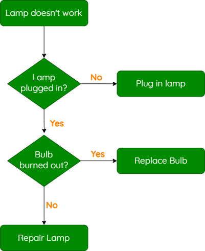

# Selection Overview

!!! info "What You Need to Know"

    For National 5 Computing Science, you should be able to:

    - Use selection to make decisions in a program.
    - Use comparison operators to create conditions.
    - Implement `if`, `if/else` and `if/elif/else` statements.

## What Is Selection?

Selection allows a program to make a decision. A condition is checked and the program follows a path depending on whether that condition is true or false.

You have already seen decisions represented by diamond shapes in flowcharts. The branches are normally labelled **Yes** and **No**.

<figure markdown="span">
  { width="400" }
</figure>

In Python, decisions are implemented using conditional statements:

- [`if`](1.4.2.1.1-if-statements.md) runs code only when a condition is true.
- [`if/else`](1.4.2.1.2-if-else-statements.md) chooses between two paths.
- [`if/elif/else`](1.4.2.1.3-if-elif-else-statements.md) chooses between several paths.

## Comparison Operators

A condition compares values. The result of a comparison is either true or false.

| Operator | Meaning | Example |
|----------|---------|---------|
| `==` | Equal to | `score == 12` |
| `!=` | Not equal to | `answer != "yes"` |
| `<` | Less than | `age < 17` |
| `>` | Greater than | `temperature > 20` |
| `<=` | Less than or equal to | `mark <= 70` |
| `>=` | Greater than or equal to | `mark >= 50` |

!!! warning "Checking Equality"

    Use two equals signs (`==`) to compare values. A single equals sign (`=`) assigns a value to a variable.

## Learning Order

Work through each type of conditional statement in order, then complete the [selection tasks](1.4.2.1.4-selection-tasks.md).
