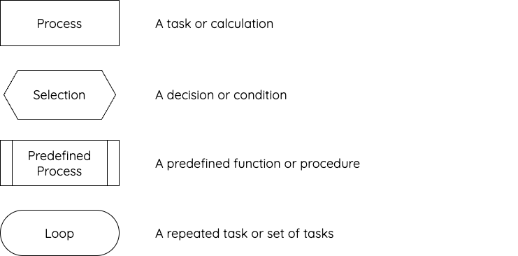
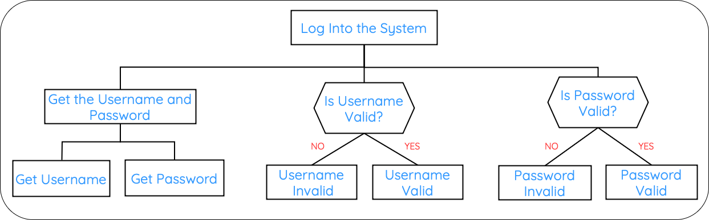

# Selection Overview

!!! info "What You Need to Know"

    For National 5 Computing Science, you should be able to:

    - Use selection to make decisions in a program.
    - Recognise selection in structure diagrams, flowcharts, and pseudocode.
    - Design solutions containing selection using structure diagrams, flowcharts, or pseudocode.
    - Use comparison operators to create conditions.
    - Implement `if`, `if/else` and `if/elif/else` statements.

## What Is Selection?

Selection allows a program to make a decision. A condition is checked and the program follows a path depending on whether that condition is true or false.

Selection can be represented in a design before it is implemented in Python. You should be able to recognise it in structure diagrams, flowcharts, and pseudocode.

## Selection in Structure Diagrams

A structure diagram breaks a problem into smaller tasks. It does **not** show the order in which instructions flow. The main task is placed at the top, with its subtasks underneath.

A selection is drawn as a pointed box. The condition or question is written inside it, and the possible outcomes branch underneath it.

<figure markdown="span">
  { width="600" }
</figure>

In the example below, `Is Username Valid?` and `Is Password Valid?` are selection subtasks. Each has **Yes** and **No** outcomes.

<figure markdown="span">
  { width="800" }
</figure>

To identify selection in a structure diagram, look for:

- a pointed selection symbol containing a condition or question
- two or more possible outcomes beneath the selection
- labels such as **Yes** and **No** that connect the outcomes to the condition

!!! note "Structure Diagrams and Flowcharts Are Different"

    A structure diagram breaks a solution into tasks and subtasks. A flowchart uses arrows to show the order in which instructions are carried out. Do not add flowchart arrows or diamond decision symbols to a structure diagram.

## Selection in Flowcharts

In a flowchart, a decision is shown using a diamond. A condition is written inside the diamond, and arrows show the different paths through the program. For a condition with two outcomes, the branches are normally labelled **Yes** and **No**.

<figure markdown="span">
  { width="400" }
</figure>

The flow of control follows only the branch selected by the answer to the condition.

To identify selection in a flowchart, look for:

- a diamond containing a condition or question
- arrows leaving the diamond
- labels such as **Yes** and **No** on the different paths

## Selection in Pseudocode and Python

In pseudocode, selection uses `IF`, `ELSE IF`, `ELSE`, and `END IF`. Python expresses the same decisions using `if`, `elif`, and `else`. The following lessons show each design alongside its Python implementation:

- [`if`](1.4.2.1.1-if-statements.md) runs code only when a condition is true.
- [`if/else`](1.4.2.1.2-if-else-statements.md) chooses between two paths.
- [`if/elif/else`](1.4.2.1.3-if-elif-else-statements.md) chooses between several paths.

## Comparison Operators

A condition compares values. The result of a comparison is either `True` or `False`.

| Operator | Meaning | Example |
|----------|---------|---------|
| `==` | Equal to | `score == 12` |
| `!=` | Not equal to | `answer != "yes"` |
| `<` | Less than | `age < 17` |
| `>` | Greater than | `temperature > 20` |
| `<=` | Less than or equal to | `mark <= 70` |
| `>=` | Greater than or equal to | `mark >= 50` |

!!! warning "Checking Equality"

    Use two equals signs (`==`) to compare values. A single equals sign (`=`) assigns a value to a variable.

## Check Your Knowledge

!!! question "Programming Task"

    Create a Python program that asks the user to enter their age.

    The program should:

    1. store the age as an integer
    2. display `True` if the user is aged 16 or over
    3. display `False` if the user is under 16

    Test the program using the ages `15`, `16`, and `17`.
