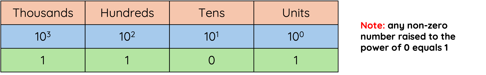
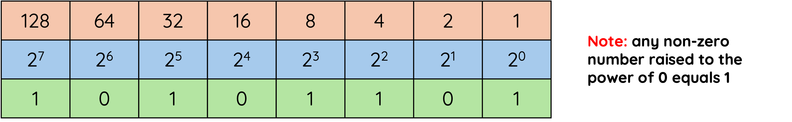

# Representing Data

Computers store and process all data using **binary**.

Binary is a number system that uses only two digits:

* 0
* 1

These binary digits are called **bits**.

---

## Decimal Numbers

The number system we use every day is called **decimal**.

Decimal is a **base 10** number system because it uses ten digits:

0, 1, 2, 3, 4, 5, 6, 7, 8 and 9

The position of each digit affects its value.

For example:

| Thousands | Hundreds | Tens | Units |
|------------|----------|------|--------|
| 3 | 4 | 2 | 7 |

This number represents:

3000 + 400 + 20 + 7 = **3427**

<figure markdown="span">
      { width="800" }
</figure>

---

## Binary Numbers

Computers use the **binary number system**.

Binary is a **base 2** number system because it uses only two digits:

0 and 1

Just like decimal numbers, the position of each digit affects its value.

<figure markdown="span">
      { width="800" }
</figure>

---

## Why Do Computers Use Binary?

Electronic components inside a computer can easily represent two states:

* ON
* OFF

These states can be represented using binary:

| State | Binary Value |
|---------|---------|
| Off | 0 |
| On | 1 |

Because computers are built from millions of electronic circuits, using only two states makes data storage and processing fast and reliable.

---

## Bits and Bytes

A single binary digit is called a **bit**.

Examples:

| Binary Value | Number of Bits |
|--------------|---------------|
| 1 | 1 bit |
| 1010 | 4 bits |
| 11001010 | 8 bits |

Eight bits together are called a **byte**.

Most binary numbers in National 5 Computing Science are represented using **8 bits (1 byte)**.

---

## Advantages of Using Binary Numbers

1. Binary is a simple two-state system (1 or 0) which is ideal when representing a two state system of power on/power off

2. There are only a few rules for addition, making calculations simpler.

3. A degraded signal can still be detected as representing 1.
