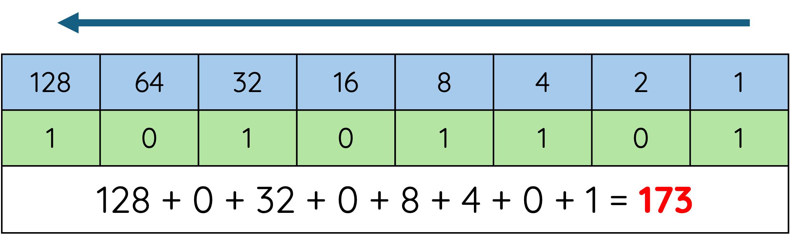

# Binary to Decimal Conversion

Binary numbers can be converted into decimal numbers by using the **binary place value table**.

Each column has a value. Starting from the right-hand side, the value begins at **1** and doubles each time you move left.

<figure markdown="span">
      { width="500" }
</figure>

---

## Conversion Steps

=== "Step 1"

    **Write the Place Values**

    For an 8-bit binary number, the place values are:

    | 128 | 64 | 32 | 16 | 8 | 4 | 2 | 1 |
    |------|------|------|------|------|------|------|------|
    |.     |.     |.     |.     |.     |.     |.     |.     |

    ==These values should be memorised for the National 5 exam.==

=== "Step 2"

    **Match the Binary Number**

    We are going to convert the binary number **01101011** into decimal.

    Place the binary number underneath the place values:

    | 128 | 64 | 32 | 16 | 8 | 4 | 2 | 1 |
    |------|------|------|------|------|------|------|------|
    | 0 | 1 | 1 | 0 | 1 | 0 | 1 | 1 |

    ==The 1s show which place values will be included in the calculation. The 0s are ignored.==

=== "Step 3"

    **Add the Values with a 1**

    Look for every column that contains a **1**. These are the values we need to add together.

    | 128 | 64 | 32 | 16 | 8 | 4 | 2 | 1 |
    |------|------|------|------|------|------|------|------|
    | 0 | 1 | 1 | 0 | 1 | 0 | 1 | 1 |

    The columns containing a 1 are:

    * 64
    * 32
    * 8
    * 2
    * 1

    Add these values together:

    64 + 32 + 8 + 2 + 1 = **107**

    Therefore, the binary number 01101011 is equal to decimal 107.

    **01101011 = 107**

    We have now successfully converted the binary number into decimal.

---

## Quick Check

To convert binary to decimal:

1. Write the place value table.
2. Write the binary number underneath.
3. Find all columns containing a 1.
4. Add those values together.
5. The total is the decimal number.

!!! warning "Exam Tip"

      Show all of your working in the exam. Even if you make a small arithmetic mistake, you may still gain marks for using the correct method.
