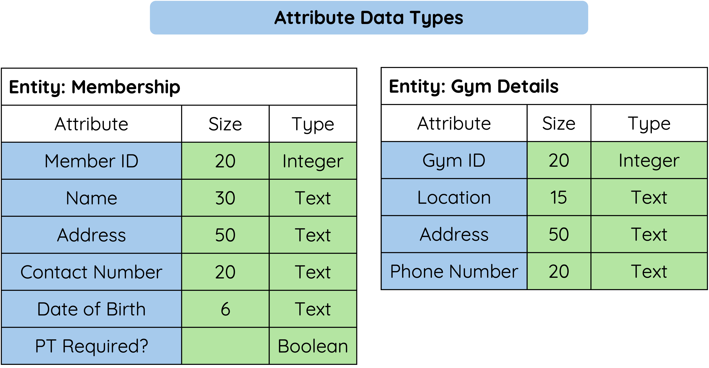

# Field Names And Data Types

## Field Names

A field name should clearly describe the data being stored.

Good field names are short but meaningful.

| Better Field Name | Less Helpful Field Name |
|-------------------|-------------------------|
| `Student_ID` | `ID` |
| `First_Name` | `Name1` |
| `Date_Of_Birth` | `Date` |
| `House` | `Info` |

Clear field names make the database easier to understand.

!!! tip "Remember"

    In database design, an attribute is a field or column in a table.

---

## Data Types

Each field must have a suitable data type.

<figure markdown="span">
  { width="550" }
</figure>

| Data Type | Used For | Example |
|-----------|----------|---------|
| Text | Words, names, addresses or codes that are not used in calculations | `Nevis` |
| Number | Whole numbers or values used in calculations | `15` |
| Real | Numbers with decimal places | `12.50` |
| Boolean | True/False or Yes/No values | `True` |
| Date | Dates | `15/06/2026` |
| Time | Times | `09:30` |

!!! warning "Common Mistake"

    A phone number or postcode is usually stored as text, not a number.

    This is because you do not calculate with it, and it may contain spaces or start with `0`.

---

## Summary

Field names should clearly describe the data being stored.

Data types should match the kind of data in the field.

- Use text for names, addresses and codes.
- Use number for whole numbers used in calculations or comparisons.
- Use real for decimal values.
- Use Boolean for True/False or Yes/No values.
- Use date and time for date or time values.
