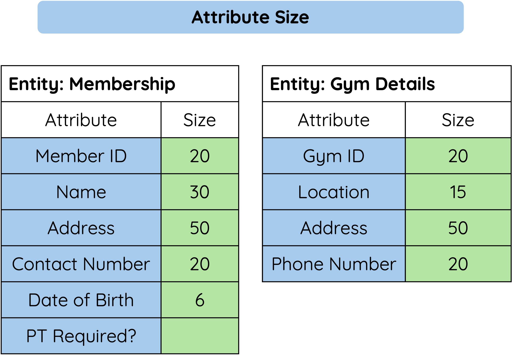

# What Is Field Size?

The field size sets the maximum amount of data that can be stored in a field.

Field size is most often used with text fields.

For example, a `Forename` field might have a size of `20`. This means the field can store up to 20 characters.

---

## Choosing A Sensible Size

<figure markdown="span">
  { width="450" }
</figure>

| Field | Data Type | Sensible Size |
|-------|-----------|---------------|
| `First_Name` | Text | 20 |
| `Surname` | Text | 30 |
| `Year_Group` | Number | 2 |
| `Postcode` | Text | 8 |

Choosing a suitable size matters.

- If the size is too small, valid data may not fit.
- If the size is much too large, storage space may be wasted.

!!! example "Example"

    `First_Name` with size `3` would be too small because names like `Eilidh` or `Daniel` would not fit.

---

## Summary

Field size controls the maximum amount of data that can be stored.

A good field size should be large enough for valid data, but not unnecessarily large.

- Text fields often need a maximum number of characters.
- A field size that is too small may cut off valid data.
- A field size that is too large may waste storage space.
