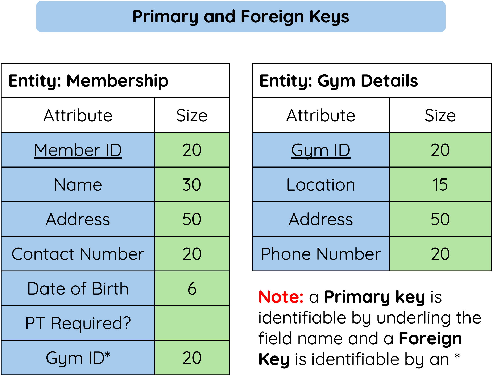

# Why Do Databases Use Keys?

Keys are used to identify records and link tables together.

<figure markdown="span">
  { width="450" }
</figure>

| Key Type | Purpose |
|----------|---------|
| Primary key | Uniquely identifies each record in a table |
| Foreign key | Links to a primary key in another table |

---

## Primary Key

A primary key must be unique.

This means no two records in the same table can have the same primary key value.

For example, `Student_ID` could be used as the primary key in a `Pupils` table because each pupil should have a different ID.

---

## Foreign Key

A foreign key is used to link one table to another table.

For example:

```text
Pupils Table
------------
Student_ID (PK)
Forename
Surname
House_ID (FK)

        links to

Houses Table
------------
House_ID (PK)
House_Name
```

In this example:

- `Student_ID` uniquely identifies each pupil.
- `House_ID` in the `Houses` table uniquely identifies each house.
- `House_ID` in the `Pupils` table links each pupil to a house.

---

## Summary

Primary and foreign keys are used to identify records and link tables.

- A primary key uniquely identifies each record in a table.
- A foreign key links to a primary key in another table.
- Keys help relational databases avoid duplication and keep linked data organised.
