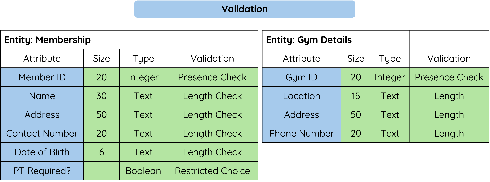

# What Is Validation?

Validation is used to reduce the chance of incorrect data being entered.

It does not check if the data is true.

It checks if the data is sensible or allowed.

---

## Common Validation Checks

<figure markdown="span">
  { width="750" }
</figure>

| Validation Type | What It Checks | Example |
|-----------------|----------------|---------|
| Presence check | Data has been entered | `Student_ID` cannot be blank |
| Range check | Data is within an allowed range | `Age` must be between 11 and 18 |
| Length check | Data has a suitable number of characters | `Postcode` must be 6 to 8 characters |
| Restricted choice | Data must be chosen from a list | `House` must be Nevis, Lochiel, Rannoch or Shiel |

!!! warning "Common Mistake"

    Validation does not guarantee that data is correct.

    For example, a range check can make sure an age is between `11` and `18`, but it cannot prove the pupil entered their real age.

---

## Choosing Validation

Choose validation based on what the field should store.

| Field | Suitable Validation |
|-------|---------------------|
| `Forename` | Presence check |
| `Age` | Range check |
| `Postcode` | Length check |
| `House` | Restricted choice |

---

## Summary

Validation reduces the chance of invalid data being entered.

- A presence check makes sure data is entered.
- A range check makes sure data is within allowed limits.
- A length check makes sure data has a suitable number of characters.
- A restricted choice makes sure data is chosen from a valid list.
