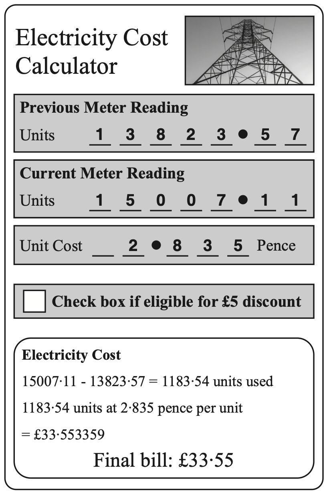

# Tasks

## Task 1

A program is required that asks a user to enter their Account Number and PIN. The program should then check to see if the customer's PIN is correct, and only allows them access if it is. If so, it displays the balance in their account.

Identify all the inputs, processes and outputs for the program above using the I-P-O table below.

<table class="ipo-table">
  <thead>
    <tr>
      <th>Inputs</th>
      <th>Process</th>
      <th>Output</th>
    </tr>
  </thead>
  <tbody>
    <tr>
      <td></td>
      <td></td>
      <td></td>
    </tr>
  </tbody>
</table>

## Task 2

A program is required that asks for a user's username and password and checks if they are correct. The outcome of the check should then be displayed and state if they have been granted access.

Identify all the inputs, processes and outputs for the program above using the I-P-O table below.

<table class="ipo-table">
  <thead>
    <tr>
      <th>Inputs</th>
      <th>Process</th>
      <th>Output</th>
    </tr>
  </thead>
  <tbody>
    <tr>
      <td></td>
      <td></td>
      <td></td>
    </tr>
  </tbody>
</table>

## Task 3

A program is required to calculate the area of a circle. The program should ask for the radius, calculate the area and display the answer.

Identify all the inputs, processes and outputs for the program above using the I-P-O table below.

<table class="ipo-table">
  <thead>
    <tr>
      <th>Inputs</th>
      <th>Process</th>
      <th>Output</th>
    </tr>
  </thead>
  <tbody>
    <tr>
      <td></td>
      <td></td>
      <td></td>
    </tr>
  </tbody>
</table>

## 2019 Past Paper Question

A smart phone app is needed to calculate the cost of electricity. The following information will be entered by the user: 

* Previous meter reading 
* Current meter reading 
* Unit cost 
* Discount eligibility 

A possible user interface for the app is shown below. 

<figure markdown="span">
      { width="300" }
</figure>

 a) Describe two processes that will be carried out by the program. 

